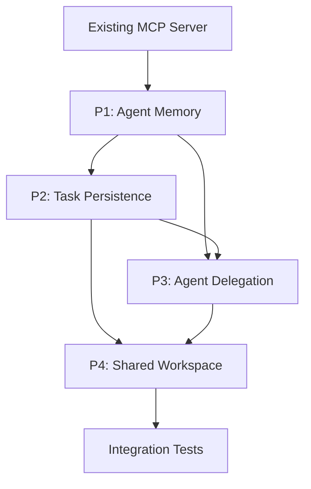

# Multi-Agent Orchestration Roadmap

This directory contains the detailed planning documentation for transforming OpenCortex into a multi-agent orchestration platform.

## Documents

| Document | Description |
|----------|-------------|
| [TRACKER.md](./TRACKER.md) | **Work tracking** - All user stories with status |
| [00-vision.md](./00-vision.md) | High-level vision and principles |
| [01-priority-agent-memory.md](./01-priority-agent-memory.md) | P1: Agent Memory Layer |
| [02-priority-task-persistence.md](./02-priority-task-persistence.md) | P2: Task/Goal Persistence (detailed breakdown) |
| [03-priority-agent-delegation.md](./03-priority-agent-delegation.md) | P3: Agent Delegation |
| [04-priority-shared-workspace.md](./04-priority-shared-workspace.md) | P4: Shared Workspace Coordination |

## Architecture Note: MCP as Foundation

**Important**: The memory, task, and workspace features build on the **existing MCP infrastructure**. We don't need new brain modes or storage mechanisms. The MCP server already provides:

```
┌─────────────────────────────────────────────────────────┐
│                    MCP Server                            │
├─────────────────────────────────────────────────────────┤
│  Tools:                                                  │
│  • save_document   → Write to managed-content brain     │
│  • query_brain     → Semantic/keyword search            │
│  • get_document    → Read full document                 │
│  • delete_document → Remove document                    │
│  • reindex_brain   → Force reindex                      │
├─────────────────────────────────────────────────────────┤
│  Brain Modes:                                            │
│  • filesystem      → Index git repos, folders           │
│  • managed-content → User-editable documents            │
└─────────────────────────────────────────────────────────┘
```

### How Features Use MCP

| Feature | MCP Usage |
|---------|-----------|
| **Agent Memory** | Thin wrapper tools (`save_memory`, `recall_memories`) that call `save_document` and `query_brain` on a per-user managed-content brain |
| **Task Persistence** | New database table + API (not MCP) - tasks are structured data, not documents |
| **Agent Delegation** | Orchestration layer - delegates to MCP for document access |
| **Shared Workspace** | Uses existing MCP tools with task-scoped brains |

### Memory Tool Example

The `save_memory` tool is just a convenience wrapper:

```csharp
// save_memory tool internally calls:
await mcpClient.SaveDocumentAsync(new SaveDocumentRequest
{
    BrainId = $"agent-memory-{userId}",  // Managed-content brain
    CanonicalPath = $"memories/{category}/{slug}.md",
    Content = memoryContent,
    Frontmatter = new { category, confidence, tags }
});
```

The `recall_memories` tool just wraps `query_brain`:

```csharp
// recall_memories tool internally calls:
var results = await mcpClient.QueryBrainAsync(
    $"FROM brain(\"agent-memory-{userId}\") SEARCH \"{query}\" RANK semantic LIMIT 5"
);
```

## Priority Summary

```
P1: Agent Memory Layer          [Foundation]
 │   └── Convenience tools over existing MCP
 │
 â–¼
P2: Task/Goal Persistence       [Tracking]
 │   └── New tasks table + API (structured data)
 │
 â–¼
P3: Agent Delegation            [Multi-Agent Core]
 │   └── Spawn sub-agents, share workspace access
 │
 â–¼
P4: Shared Workspace            [Collaboration]
     └── Locking & change notifications (new features)
```

## Effort Overview

| Priority | Estimated Effort | Features | User Stories | Tasks |
|----------|------------------|----------|--------------|-------|
| P1 | ~1-2 weeks | 4 | 9 | 29 |
| P2 | ~6-7 weeks | 5 | 17 | 100 |
| P3 | ~8-9 weeks | 5 | 17 | 80 |
| P4 | ~5 weeks | 4 | 11 | 45 |
| **Total** | **~20-23 weeks** | **18** | **54** | **254** |

### Portal UI Breakdown (included above)

| Area | User Stories | Tasks | Hours |
|------|--------------|-------|-------|
| Work Items Board/Backlog | 6 | 40 | ~98h |
| Agent Configuration | 7 | 35 | ~57h |
| **Total UI** | **13** | **75** | **~155h** |

## Getting Started

1. Review the [vision document](./00-vision.md) for overall direction
2. Start with [P1: Agent Memory](./01-priority-agent-memory.md) as the foundation
3. Use the detailed breakdown in [P2: Task Persistence](./02-priority-task-persistence.md) as a template for implementation

## Work Item Hierarchy

```
Epic (e.g., "Task & Goal Management System")
  └── Feature (e.g., "Task Data Model & Storage")
        └── User Story (e.g., "As an agent, I want to create a task...")
              └── Task (e.g., "Create tasks table migration")
                    └── Slice (e.g., specific SQL, code snippets)
```

## Key Decisions

| Decision | Choice | Rationale |
|----------|--------|-----------|
| Memory storage | Existing MCP managed-content | Already built, just add wrapper tools |
| Task persistence | New table | Need structured queries, not document search |
| Agent profiles | Database + seeded defaults | Flexibility + out-of-box experience |
| Delegation model | Synchronous by default | Simpler mental model, async optional |
| Locking strategy | Advisory locks | Non-blocking, timeout-based |

## Dependencies



---

## Cross-Priority Integration Tests

End-to-end scenarios validating all priorities work together seamlessly.

### Integration Test Scenarios

| Scenario | Priorities | Description |
|----------|------------|-------------|
| **Memory Across Sessions** | P1 | Agent saves memory, new session recalls it |
| **Epic Planning Flow** | P1, P2 | User creates epic, AI breaks it down, items tracked |
| **Delegated Research** | P1, P2, P3 | Lead agent delegates to researcher, results saved as memory |
| **Multi-Agent Document Collab** | P1-P4 | Two agents edit shared doc with locking |
| **Full Workflow** | P1-P4 | Epic → delegate tasks → agents collaborate → complete |

### Test Infrastructure

| Component | Purpose |
|-----------|---------|
| `IntegrationTestBase` | Shared setup: DB, MCP, test users |
| `TestAgentOrchestrator` | Controlled agent execution for tests |
| `MockLlmProvider` | Deterministic LLM responses |
| `TestWorkspaceManager` | Isolated test workspaces |

### Key Test Cases

```
IT-001: Memory persistence across sessions
IT-002: Work item hierarchy CRUD (Epic→Feature→Story→Task)
IT-003: AI epic breakdown creates correct hierarchy
IT-004: Agent delegation executes and returns results
IT-005: Document locking prevents concurrent edits
IT-006: Conflict detection on stale writes
IT-007: Task workspace shared between delegated agents
IT-008: Full planning-to-completion workflow
```

---

## Migration & Upgrade Path

Strategy for incrementally upgrading existing deployments.

### Database Migrations

| Migration | Priority | Description |
|-----------|----------|-------------|
| `0009_user_memory_brain.sql` | P1 | Adds memory_brain_id to users table |
| `0010_tenant_scoped_user_provider_configs.sql` | Current | Corrective migration that scopes provider configs by customer + user |
| `0011_work_items.sql` | P2 | Work items table + sequences |
| `0012_sprints.sql` | P2 | Sprints table for sprint planning |
| `0013_agent_profiles.sql` | P3 | Agent profiles + default seeding |
| `0014_document_locks.sql` | P4 | Advisory locking table |
| `0015_document_changes.sql` | P4 | Change tracking table |

### Upgrade Sequence

Numbering note: `0010_tenant_scoped_user_provider_configs.sql` is now a real migration in the main repo. Planned roadmap migrations therefore start at `0011_work_items.sql`, then continue with `0012_sprints.sql`, `0013_agent_profiles.sql`, `0014_document_locks.sql`, and `0015_document_changes.sql`.

```
┌─────────────────────────────────────────────────────────┐
│                   Upgrade Strategy                        │
├─────────────────────────────────────────────────────────┤
│                                                          │
│  Phase 1: P1 (Memory) - Additive                        │
│  ├── Run 0009_user_memory_brain.sql migration           │
│  ├── Deploy new memory tools                            │
│  ├── Deploy Portal Memories page                        │
│  └── Existing brains used for memories                  │
│                                                          │
│  Phase 2: P2 (Work Items) - Additive                    │
│  ├── Run 0011_work_items.sql migration                  │
│  ├── Run 0012_sprints.sql migration                     │
│  ├── Deploy work item API + tools                       │
│  ├── Deploy Portal board UI                             │
│  └── Existing conversations unaffected                  │
│                                                          │
│  Phase 3: P3 (Delegation) - Additive                    │
│  ├── Run 0013_agent_profiles.sql migration              │
│  ├── Default agents seeded automatically                │
│  ├── Deploy delegation tools                            │
│  ├── Deploy agent configuration UI                      │
│  └── Existing agents continue working                   │
│                                                          │
│  Phase 4: P4 (Workspace) - Additive                     │
│  ├── Run 0014 + 0015 migrations                         │
│  ├── Deploy locking + change tracking                   │
│  └── Enables multi-agent collaboration                  │
│                                                          │
└─────────────────────────────────────────────────────────┘
```

### Rollback Strategy

Each phase is independently rollback-able:
- Feature flags control tool availability
- Migrations are additive (no destructive changes)
- Old clients ignore new API endpoints

### Zero-Downtime Deployment

1. Deploy API with new endpoints (feature-flagged off)
2. Run database migrations
3. Enable feature flags per-customer
4. Monitor and validate
5. Enable globally

---

## API Versioning Strategy

### Current Approach

- No explicit versioning yet (v1 implicit)
- Breaking changes avoided via additive design

### Recommended Strategy

| Aspect | Approach |
|--------|----------|
| URL Versioning | `/api/v1/work-items`, `/api/v2/...` when needed |
| Header Versioning | `X-API-Version: 2024-01` for minor variations |
| Deprecation | 6-month notice, sunset headers |
| SDK Versioning | Semantic versioning for client libraries |

### Breaking Change Policy

1. **Avoid** - Prefer additive changes
2. **Communicate** - Announce in release notes
3. **Sunset** - Minimum 6 months deprecation
4. **Version** - New major version for breaking changes

### Compatibility Considerations

- New optional fields should have defaults
- Enum extensions are non-breaking
- Removed fields should return `null` first
- New required fields need migration path
